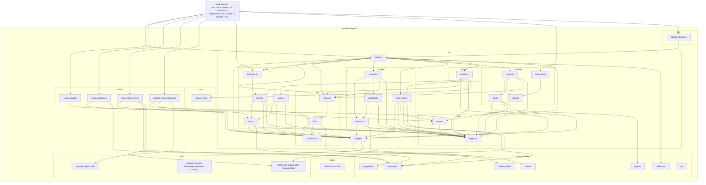
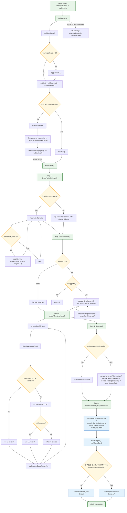

```mermaid
flowchart TB
  %% ===== Entry =====
  pkg["package.json<br/>start: node --import tsx src/index.ts<br/>digest:once | dev | setup:* | migrate | test"]

  %% ===== Top-level dirs =====
  subgraph root["padsplit-digest/"]
    direction TB

    subgraph bin_dir["bin/"]
      bin_cli["padsplit-digest.js"]
    end

    subgraph data_dir["data/"]
      data_db["padsplit-digest.sqlite"]
      data_ps["padsplit-session/ (Playwright persistent context)"]
      data_hw["honeywell-session.json (storageState)"]
    end

    subgraph docs_dir["docs/"]
      docs_plan["claude-plan-v2.md"]
    end

    subgraph nm_dir["node_modules/"]
      nm_google["googleapis"]
      nm_openai["openai"]
      nm_playwright["playwright"]
      nm_sqlite["better-sqlite3"]
      nm_cron["node-cron"]
      nm_dotenv["dotenv"]
      nm_tsx["tsx"]
    end

    subgraph out_dir["out/"]
      out_html["digest-<TIMESTAMP>.html"]
    end

    subgraph scripts_dir["scripts/"]
      s_oauth["setup-oauth.ts"]
      s_padsplit["setup-padsplit.ts"]
      s_honeywell["setup-honeywell.ts"]
      s_migrate["migrate-conversations.ts"]
    end

    subgraph src_dir["src/"]
      src_index["index.ts"]
      src_config["config.ts"]

      subgraph db_mod["db/"]
        db_init["init.ts"]
        db_items["items.ts"]
        db_schema["schema.sql"]
      end

      subgraph gmail_mod["gmail/"]
        g_auth["auth.ts"]
        g_fetch["fetch.ts"]
        g_send["send.ts"]
        g_fetch_test["fetch.test.ts"]
      end

      subgraph classifier_mod["classifier/"]
        c_index["index.ts"]
        c_rules["rules.ts"]
        c_llm["llm.ts"]
        c_rules_test["rules.test.ts"]
      end

      subgraph digest_mod["digest/"]
        d_builder["builder.ts"]
      end

      subgraph scraper_mod["scraper/"]
        sc_browser["browser.ts"]
        sc_padsplit["padsplit.ts"]
        sc_resolver["resolver.ts"]
        sc_honeywell["honeywell.ts"]
      end

      subgraph utils_mod["utils/"]
        u_logger["logger.ts"]
        u_retry["retry.ts"]
      end
    end
  end

  %% ===== package.json script entry links =====
  pkg --> src_index
  pkg --> s_oauth
  pkg --> s_padsplit
  pkg --> s_honeywell
  pkg --> s_migrate
  pkg --> g_fetch_test
  pkg --> c_rules_test
  pkg --> bin_cli

  bin_cli --> src_index

  %% ===== src import / call graph =====
  src_index --> src_config
  src_index --> db_init
  src_index --> db_items
  src_index --> g_fetch
  src_index --> sc_resolver
  src_index --> c_index
  src_index --> sc_honeywell
  src_index --> d_builder
  src_index --> u_logger
  src_index --> nm_cron

  src_config --> nm_dotenv
  src_config --> data_dir

  db_init --> src_config
  db_init --> db_schema
  db_init --> nm_sqlite
  db_items --> db_init

  g_auth --> src_config
  g_auth --> u_logger
  g_auth --> nm_google
  g_fetch --> g_auth
  g_fetch --> src_config
  g_fetch --> u_logger
  g_fetch --> u_retry
  g_send --> g_auth
  g_send --> src_config
  g_send --> u_logger

  c_index --> c_rules
  c_index --> c_llm
  c_index --> db_items
  c_index --> u_logger
  c_llm --> src_config
  c_llm --> u_logger
  c_llm --> u_retry
  c_llm --> nm_openai

  d_builder --> db_items
  d_builder --> src_config
  d_builder --> g_send
  d_builder --> sc_honeywell
  d_builder --> u_logger
  d_builder --> out_html

  sc_browser --> src_config
  sc_browser --> u_logger
  sc_browser --> nm_playwright
  sc_padsplit --> sc_browser
  sc_padsplit --> u_logger
  sc_resolver --> sc_browser
  sc_resolver --> sc_padsplit
  sc_resolver --> db_items
  sc_resolver --> u_logger
  sc_honeywell --> src_config
  sc_honeywell --> u_logger
  sc_honeywell --> u_retry
  sc_honeywell --> nm_playwright
  sc_honeywell --> data_hw

  u_retry --> u_logger

  %% ===== scripts links =====
  s_oauth --> g_auth
  s_padsplit --> src_config
  s_padsplit --> nm_playwright
  s_honeywell --> src_config
  s_honeywell --> nm_playwright
  s_honeywell --> data_hw
  s_migrate --> db_init
  s_migrate --> u_logger
  s_migrate --> data_db

  %% ===== tests =====
  g_fetch_test --> g_fetch
  c_rules_test --> c_rules

```

```mermaid
flowchart TD
  start["package.json start/digest:once -> src/index.ts"] --> main["main() async"]

  main --> validate["validateConfig()"]
  validate --> warn_check{warnings.length > 0?}
  warn_check -->|yes| warn_log["logger.warn(...)"]
  warn_check -->|no| db_boot
  warn_log --> db_boot["getDb() -> initSchema() -> runMigrations()"]

  db_boot --> once_check{"argv has --once or --run?"}
  once_check -->|yes| run_once["runOnce()"]
  once_check -->|no| sched["startScheduler()"]

  %% scheduler path
  sched --> cron_loop["for each cron expression in config.schedule.digestTimes"]
  cron_loop --> cron_task["cron.schedule(async () => runPipeline())"]
  cron_task -. async trigger .-> pipeline

  %% one-shot path
  run_once --> pipeline["runPipeline()"]

  %% pipeline internals
  pipeline --> step1["Step 1: fetchPadSplitEmails()"]
  step1 --> gmail_try{Gmail fetch succeeds?}
  gmail_try -->|yes| email_loop["for email of emails"]
  email_loop --> exists_check{"itemExists(email.id)?"}
  exists_check -->|no| insert["insertItem({... sender_email, source, subject ...})"]
  exists_check -->|yes| skip_insert["skip"]
  insert --> email_loop
  skip_insert --> email_loop
  email_loop --> step2
  gmail_try -->|no| gmail_err["log error and continue with existing DB data"] --> step2["Step 2: resolveLinks()"]

  step2 --> resolver_try{resolver runs?}
  resolver_try -->|error| resolver_err["log and continue"] --> step3
  resolver_try -->|ok| login_check{"isLoggedIn()?"}
  login_check -->|no| no_resolve["return 0"]
  login_check -->|yes| link_loop["loop pending items with link_url && !body_resolved"]
  link_loop --> scrape["scrapeMessagePage(url) + updateItemResolved()"]
  scrape --> link_loop
  no_resolve --> step3["Step 3: classifyPendingItems()"]
  link_loop --> step3

  step3 --> pending_loop["for pending DB items"]
  pending_loop --> classify_msg["classifyMessage(text)"]
  classify_msg --> rules_check{"rules high-risk OR confident?"}
  rules_check -->|yes| rules_path["use rules result"]
  rules_check -->|no| llm_try["try classifyWithLLM()"]
  llm_try --> llm_ok{"LLM success?"}
  llm_ok -->|yes| llm_path["use LLM result"]
  llm_ok -->|no| llm_fallback["fallback to rules"]
  rules_path --> upd_class["updateItemClassification(...)"]
  llm_path --> upd_class
  llm_fallback --> upd_class
  upd_class --> pending_loop

  step3 --> step4["Step 4: Honeywell"]
  step4 --> hw_cfg{"hasHoneywellCredentials()?"}
  hw_cfg -->|no| hw_skip["skip thermostat scrape"]
  hw_cfg -->|yes| hw_scrape["scrapeHoneywellThermostats()<br/>restore session -> login if needed -> scrape readings -> save storageState"]
  hw_skip --> step5
  hw_scrape --> step5["Step 5: buildAndSendDigest(thermostats)"]

  step5 --> build_html["getUnsentClassifiedItems() -> groupBySenderCategory()<br/>render HTML -> write ./out/digest-<TIMESTAMP>.html"]
  build_html --> digest_db["createDigest(); markItemsSent()"]

  digest_db --> send_gate{"ENABLE_EMAIL_SENDING=true<br/>AND --send-email flag?"}
  send_gate -->|no| no_send["skip email send (safe default)"]
  send_gate -->|yes| send_email["sendDigestEmail() via Gmail API"]

  no_send --> done["pipeline complete"]
  send_email --> done

  %% shutdown path
  main -. signal SIGINT/SIGTERM .-> shutdown["shutdown(): cleanupScraper(); closeDb(); exit"]

  classDef main fill:#e8f5e9,stroke:#2e7d32,stroke-width:2px;
  classDef decision fill:#fff8e1,stroke:#f9a825,stroke-width:1.5px;
  classDef io fill:#e3f2fd,stroke:#1565c0,stroke-width:1.5px;

  class start,main,pipeline,step1,step2,step3,step4,step5,done main;
  class warn_check,once_check,gmail_try,exists_check,resolver_try,login_check,rules_check,llm_ok,hw_cfg,send_gate decision;
  class build_html,digest_db,send_email,no_send io;

```