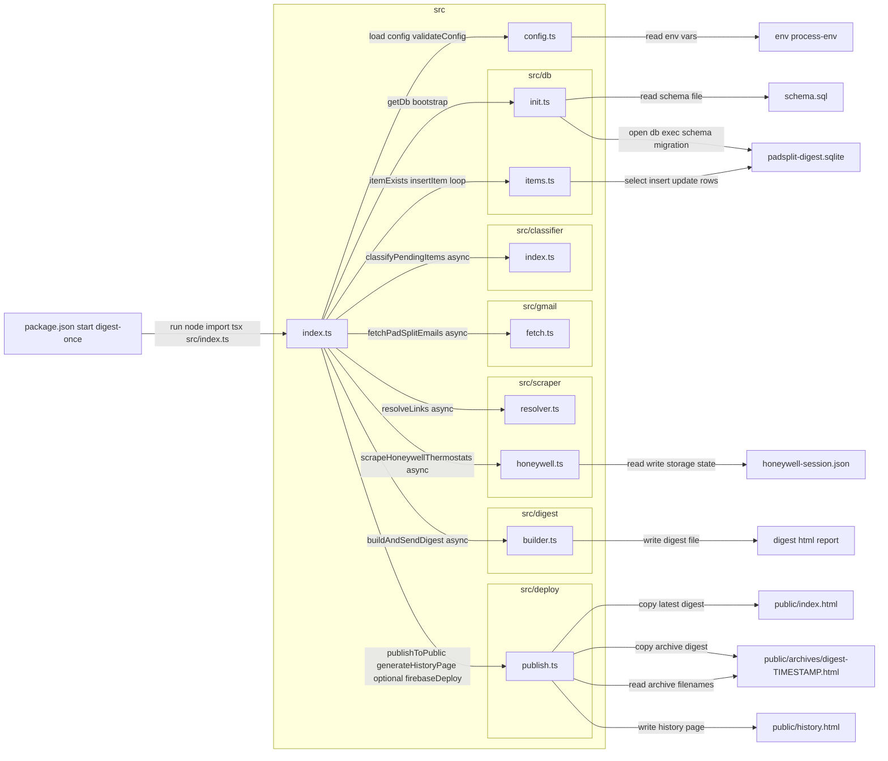

# Architecture

```mermaid
flowchart LR
  PKG[package.json start digest-once]

  subgraph SRC[src]
    IDX[index.ts]
    CFG[config.ts]

    subgraph DB[src/db]
      DB_INIT[init.ts]
      DB_ITEMS[items.ts]
    end

    subgraph GMAIL[src/gmail]
      G_FETCH[fetch.ts]
    end

    subgraph SCRAPER[src/scraper]
      SC_RES[resolver.ts]
      SC_HW[honeywell.ts]
    end

    subgraph CLASSIFIER[src/classifier]
      C_INDEX[index.ts]
    end

    subgraph DIGEST[src/digest]
      D_BUILD[builder.ts]
    end

    subgraph DEPLOY[src/deploy]
      D_PUB[publish.ts]
    end
  end

  ENV[env process-env]
  SCHEMA[schema.sql]
  SQLITE[padsplit-digest.sqlite]
  OUT_HTML[digest html report]
  PUBLIC_INDEX[public/index.html]
  PUBLIC_ARCHIVE[public/archives/digest-TIMESTAMP.html]
  PUBLIC_HISTORY[public/history.html]
  HW_SESSION[honeywell-session.json]

  PKG -->|run node import tsx src/index.ts| IDX

  IDX -->|load config validateConfig| CFG
  IDX -->|getDb bootstrap| DB_INIT
  IDX -->|fetchPadSplitEmails async| G_FETCH
  IDX -->|itemExists insertItem loop| DB_ITEMS
  IDX -->|resolveLinks async| SC_RES
  IDX -->|classifyPendingItems async| C_INDEX
  IDX -->|scrapeHoneywellThermostats async| SC_HW
  IDX -->|buildAndSendDigest async| D_BUILD
  IDX -->|publishToPublic generateHistoryPage optional firebaseDeploy| D_PUB

  CFG -->|read env vars| ENV
  DB_INIT -->|read schema file| SCHEMA
  DB_INIT -->|open db exec schema migration| SQLITE
  DB_ITEMS -->|select insert update rows| SQLITE
  D_BUILD -->|write digest file| OUT_HTML
  D_PUB -->|copy latest digest| PUBLIC_INDEX
  D_PUB -->|copy archive digest| PUBLIC_ARCHIVE
  D_PUB -->|write history page| PUBLIC_HISTORY
  D_PUB -->|read archive filenames| PUBLIC_ARCHIVE
  SC_HW -->|read write storage state| HW_SESSION
```
