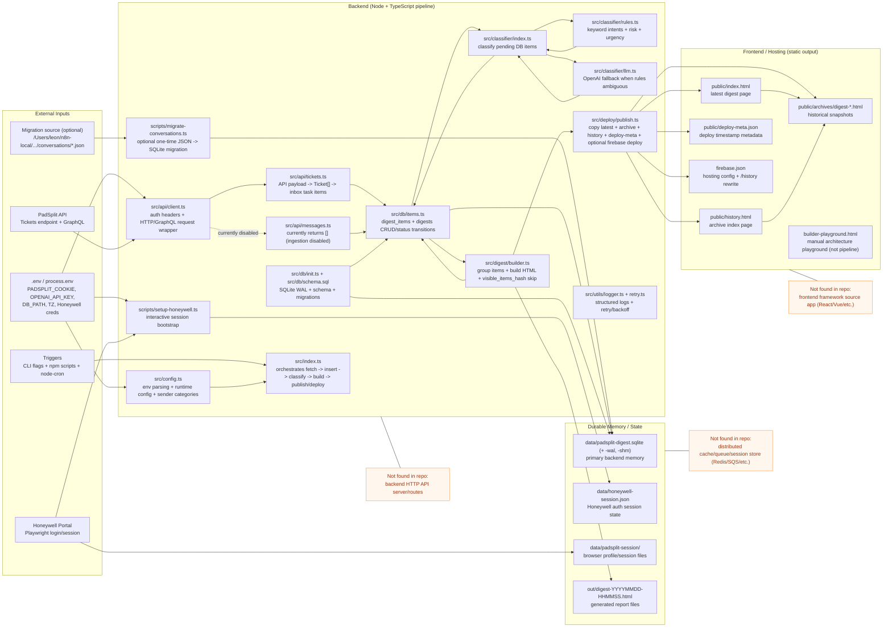

# PadSplit Digest Architecture (Mermaid)

```mermaid
flowchart LR
  %% External inputs
  subgraph EXT["External Inputs"]
    ENV[".env / process.env<br/>PADSPLIT_COOKIE, OPENAI_API_KEY,<br/>DB_PATH, TZ, Honeywell creds"]
    PADAPI["PadSplit API<br/>Tickets endpoint + GraphQL"]
    TRIG["Triggers<br/>CLI flags + npm scripts + node-cron"]
    HPORTAL["Honeywell Portal<br/>Playwright login/session"]
    MIGSRC["Migration source (optional)<br/>/Users/leon/n8n-local/.../conversations/*.json"]
  end

  %% Backend
  subgraph BE["Backend (Node + TypeScript pipeline)"]
    INDEX["src/index.ts<br/>orchestrates fetch -> insert -> classify -> build -> publish/deploy"]
    CFG["src/config.ts<br/>env parsing + runtime config + sender categories"]
    CLIENT["src/api/client.ts<br/>auth headers + HTTP/GraphQL request wrapper"]
    TICKETS["src/api/tickets.ts<br/>API payload -> Ticket[] -> inbox task items"]
    MSGS["src/api/messages.ts<br/>currently returns [] (ingestion disabled)"]

    CLASS["src/classifier/index.ts<br/>classify pending DB items"]
    RULES["src/classifier/rules.ts<br/>keyword intents + risk + urgency"]
    LLM["src/classifier/llm.ts<br/>OpenAI fallback when rules ambiguous"]

    DBINIT["src/db/init.ts + src/db/schema.sql<br/>SQLite WAL + schema + migrations"]
    DBITEMS["src/db/items.ts<br/>digest_items + digests CRUD/status transitions"]

    BUILD["src/digest/builder.ts<br/>group items + build HTML + visible_items_hash skip"]
    PUB["src/deploy/publish.ts<br/>copy latest + archive + history + deploy-meta + optional firebase deploy"]
    UTIL["src/utils/logger.ts + retry.ts<br/>structured logs + retry/backoff"]

    SETUPHW["scripts/setup-honeywell.ts<br/>interactive session bootstrap"]
    MIGRATE["scripts/migrate-conversations.ts<br/>optional one-time JSON -> SQLite migration"]
  end

  %% Frontend/hosting
  subgraph FE["Frontend / Hosting (static output)"]
    PINDEX["public/index.html<br/>latest digest page"]
    PHIST["public/history.html<br/>archive index page"]
    PARCH["public/archives/digest-*.html<br/>historical snapshots"]
    PMETA["public/deploy-meta.json<br/>deploy timestamp metadata"]
    FCFG["firebase.json<br/>hosting config + /history rewrite"]
    PLAY["builder-playground.html<br/>manual architecture playground (not pipeline)"]
  end

  %% Durable memory/state
  subgraph MEM["Durable Memory / State"]
    SQLITE["data/padsplit-digest.sqlite (+ -wal, -shm)<br/>primary backend memory"]
    HSESS["data/honeywell-session.json<br/>Honeywell auth session state"]
    PSESS["data/padsplit-session/<br/>browser profile/session files"]
    OUT["out/digest-YYYYMMDD-HHMMSS.html<br/>generated report files"]
  end

  %% Control + data flow
  TRIG --> INDEX
  ENV --> CFG --> INDEX
  ENV --> CLIENT
  PADAPI --> CLIENT
  CLIENT --> TICKETS --> DBITEMS
  CLIENT -. "currently disabled" .-> MSGS --> DBITEMS

  DBITEMS --> CLASS
  CLASS --> RULES
  CLASS --> LLM
  RULES --> CLASS
  LLM --> CLASS
  CLASS --> DBITEMS

  DBINIT --> DBITEMS
  DBITEMS --> BUILD
  BUILD --> OUT
  BUILD --> DBITEMS
  BUILD --> PUB
  PUB --> PINDEX
  PUB --> PARCH
  PUB --> PHIST
  PUB --> PMETA
  PUB --> FCFG

  %% Optional honeywell path (currently not called by src/index.ts)
  ENV --> SETUPHW --> HSESS
  HPORTAL --> SETUPHW
  HPORTAL --> PSESS

  %% Optional migration path
  MIGSRC --> MIGRATE --> SQLITE

  %% Persistence links
  DBITEMS --> SQLITE
  DBINIT --> SQLITE
  PINDEX --> PARCH
  PHIST --> PARCH

  %% Explicit gaps
  NF1["Not found in repo:<br/>frontend framework source app (React/Vue/etc.)"]:::nf
  NF2["Not found in repo:<br/>backend HTTP API server/routes"]:::nf
  NF3["Not found in repo:<br/>distributed cache/queue/session store (Redis/SQS/etc.)"]:::nf

  FE --- NF1
  BE --- NF2
  MEM --- NF3

  classDef nf fill:#fff7ed,stroke:#fb923c,color:#9a3412,stroke-width:1px;
```

